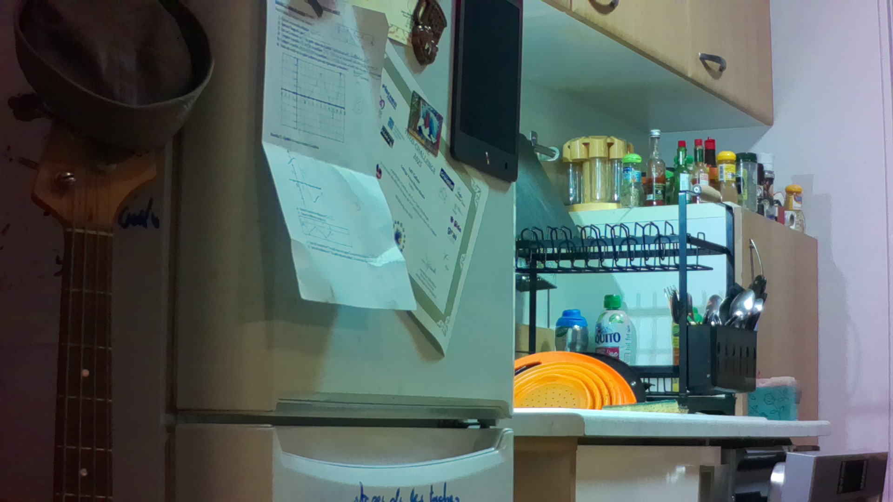

# Pi5 Bird Feeder - Individual Recognition System

Système autonomous de surveillance du mangeoir à oiseaux avec reconnaissance individuelle des mésanges par IA légère et dashboard web temps-réel.

**Objectif**: Identifier les ~50 mésanges individuelles qui viennent au mangeoir, suivre leur fréquentation (4x aujourd'hui, 28x ce mois), et exposer les données via un dashboard web avec courbes et métriques environnementales.

## Validation caméra

Capture réelle obtenue avec la caméra IMX219 branchée sur le port CSI0 du Raspberry Pi 5.



---

## 📊 État d'Avancement

### Phase 1: Setup & Capture ✅ TERMINÉ
- [x] Repo + structure dossier
- [x] Configuration de base (config.py)
- [x] Dépendances (requirements.txt)
- [x] Détection caméra Pi5 (IMX219 / CSI0)
- [x] Capture 1 image réelle (1920×1080, 344KB)
- [x] Sauvegarde images timestampées
- [x] Boucle de capture dans `src/main.py` (interval configurable)
- [x] Détection mouvement PIL frame-diff (scores réels: 0.001–0.18)
- [x] Pipeline staging → captures (motion-gated)
- [x] SQLite `motion_events` + enregistrement automatique
- [x] Nettoyage staging au démarrage
- [x] Script diagnostic caméra `test_camera_detection.py`

### Phase 2: Détection ✅ TERMINÉ
- [x] Modèle YOLO11n ONNX (10MB, CPU, ~185ms/inférence sur Pi5)
- [x] `onnxruntime` installé sur Pi5
- [x] `BirdDetector.detect()` avec preprocessing letterbox + NMS
- [x] Validé sur mésange réelle : **conf=0.862**
- [x] Détection intégrée dans la boucle principale (après motion)
- [ ] Cropping oiseaux individuels
- [ ] Tests unitaires `tests/test_detection.py`

### Phase 3: Reconnaissance Individuelle 🧠 À FAIRE
- [ ] SQLite schema + tables
- [ ] Feature extraction (MobileNetV2)
- [ ] Matching par distance cosinus
- [ ] Enregistrement des individus (#1 → #50)
- [ ] Tests matching

### Phase 4: Web Dashboard 🌐 À FAIRE
- [ ] Flask API REST (/api/birds, /api/sightings)
- [ ] WebSocket temps-réel
- [ ] Dashboard HTML/CSS/JS
- [ ] Graphes (fréquentation, courbes)
- [ ] Tests intégration

### Phase 5: Autonomie & Production 🔋 À FAIRE
- [ ] Monitoring batterie (voltage)
- [ ] Mode low-power si batterie faible
- [ ] Logs + alertes (fichier log)
- [ ] Optimisations (cache embeddings, compression)
- [ ] Tests endurance (24h+)

---

## 🚀 Installation

### Prérequis
- **Raspberry Pi 5** avec Raspberry Pi OS / Bookworm
- **Caméra IMX219** compatible Raspberry Pi (testée sur Arducam IMX219)
- **Connexion CSI0**
- **VRAM**: min 2GB
- **SD Card**: min 16GB

### Setup

```bash
# Cloner repo
cd ~/Documents/py/iot/
git clone <url-repo> pi5-birdfeeder
cd pi5-birdfeeder

# Env Python (optionnel, recommandé)
python3 -m venv venv
source venv/bin/activate

# Installer dépendances
pip install -r requirements.txt

# Copier .env
cp .env.example .env
# éditer .env si nécessaire (ports, résolutions, etc.)

# Dépendances système caméra
sudo apt install -y python3-picamera2 python3-libcamera python3-dotenv
```

---

## 🏃 Lancement

### Phase 1 (Setup)
```bash
python3 src/main.py
```

**Comportement attendu**:
```
2026-03-22 15:30:45,123 - __main__ - INFO - 🐦 Pi5 Bird Feeder - Starting...
2026-03-22 15:30:45,124 - __main__ - INFO - Phase 1: Setup & Camera Capture
2026-03-22 15:30:45,125 - __main__ - INFO - Capture interval: 60s
✅ Camera loop started. Ctrl+C pour arrêter.
```

Le programme capture ensuite une image toutes les `CAPTURE_INTERVAL_SECONDS` secondes dans `data/captures/`.

### Phase 4 (Web)
```bash
python src/api.py
# Accder à http://localhost:5000/
```

---

## 🏗️ Architecture

```
pi5-birdfeeder/
├── src/
│   ├── __init__.py
│   ├── config.py              # Paramètres centralisés (à partir .env)
│   ├── main.py                # Entry point
│   ├── camera.py              # Capture caméra Pi5 (libcamera)
│   ├── detection.py           # YOLO11n ONNX — bird detection ✅
│   ├── motion.py              # PIL frame-diff motion detection ✅
│   ├── database.py            # SQLite motion_events ✅
│   ├── features.py            # MobileNetV2 embedding (Phase 3)
│   ├── matching.py            # Distance cosinus matching (Phase 3)
│   ├── api.py                 # Flask REST + WebSocket (Phase 4)
│   └── logger.py              # Logging config
├── tests/
│   ├── __init__.py
│   ├── test_camera.py
│   ├── test_detection.py
│   ├── test_database.py
│   └── test_matching.py
├── web/
│   ├── index.html             # Dashboard UI
│   ├── style.css              # Styles
│   └── app.js                 # Logic frontend
├── models/                    # Modèles ML
│   ├── yolo11n.onnx           # YOLO11n ONNX ✅ (non versionné, ~10MB)
│   └── mobilenetv2.tflite     # (Phase 3, à télécharger)
├── data/
│   ├── birdfeeder.db          # DB SQLite ✅ (motion_events)
│   ├── staging/               # Images temporaires (nettoyées au démarrage)
│   └── captures/              # Images avec mouvement détecté
├── docs/
│   ├── DATAFLOW.md            # Flux de données complet
│   ├── API.md                 # Endpoints REST (Phase 4)
│   └── DATABASE.md            # Schéma SQLite (Phase 3)
├── logs/
│   └── birdfeeder.log         # Log fichier
├── .gitignore
├── .env.example               # Variables d'environnement
├── config.py                  # Configuration (charge .env)
├── README.md                  # Cette file
└── requirements.txt           # Dépendances Python
```

---

## 📡 Flux de Données

Voir [docs/DATAFLOW.md](docs/DATAFLOW.md)

```
Camera IMX219 → Staging (frame N)
  ↓
Motion Detection (PIL diff, score) ──✅──→ Persist (captures/)
  ↓ si motion                              ↓
YOLO11n ONNX ──✅──→ BirdDetection     SQLite (motion_events)
  ↓ (Phase 3)
MobileNetV2 Embedding → Matching cosinus → Individu #N
  ↓ (Phase 4)
Flask API → WebSocket → Dashboard
```

**Latence actuelle (Pi5)**: capture ~80ms + inférence YOLO ~185ms = ~265ms/cycle

---

## 🔌 Configuration

### `.env.example` → `.env`

```bash
cp .env.example .env
```

Édite `.env` si besoin:

```env
# Camera
CAMERA_RESOLUTION=3280x2464       # résolution max IMX219
CAMERA_FRAMERATE=20
CAPTURE_INTERVAL_SECONDS=60

# Motion detection
MOTION_SCORE_THRESHOLD=0.02
MOTION_RESIZE_WIDTH=320
MOTION_RESIZE_HEIGHT=180

# Detection
YOLO_CONFIDENCE=0.5               # Confiance min détection
YOLO_IOU=0.45

# Recognition
EMBEDDING_THRESHOLD=0.7           # Threshold distance cosinus
MAX_INDIVIDUALS=50

# Database
DB_PATH=data/birdfeeder.db

# Flask
FLASK_PORT=5000
FLASK_HOST=0.0.0.0
FLASK_DEBUG=False

# Logging
LOG_LEVEL=INFO
LOG_FILE=logs/birdfeeder.log
```

---

## 🧪 Tests

```bash
# Run all tests
pytest tests/

# Run spécific module
pytest tests/test_camera.py -v

# Run with coverage
pytest tests/ --cov=src --cov-report=html
```

---

## 📚 Documentation Détaillée

- **[DATAFLOW.md](docs/DATAFLOW.md)** - Architecture flux de données
- **[API.md](docs/API.md)** - Endpoints REST + WebSocket
- **[DATABASE.md](docs/DATABASE.md)** - Schéma SQLite détaillé

---

## 🤝 Gestion de Projet

### Git Workflow
```
main (stable)
  ← develop (intégration)
    ← feature/camera-capture
    ← feature/detection
    ← feature/recognition
    ← feature/api
```

### Issues & Milestones
- 1 issue par étape/fonctionnalité
- Labels: `phase-1`, `phase-2`, ..., `bug`, `enhancement`
- Milestones: `Phase 1: Setup`, `Phase 2: Detection`, etc.

### Commits
```bash
git commit -m "feat: implement camera capture"
git commit -m "fix: config path issue"
git commit -m "docs: update README for Phase 2"
```

---

## 🚦 Roadmap

| Version | Phase | État | ETA |
|---------|-------|------|-----|
| **v0.1** | Phase 1: Setup & Capture | ✅ Terminé | — |
| **v0.2** | Phase 2: Détection YOLO | ✅ Terminé | — |
| **v0.5** | Phase 3: Reconnaissance individuelle | 🔜 À faire | — |
| **v1.0** | Phase 4: Web Dashboard | 🔜 À faire | — |
| **v1.1** | Phase 5: Autonomie & Production | 🔜 À faire | — |

---

## 🐛 Troubleshooting

### Camera non détectée
```bash
rpicam-still --list-cameras
v4l2-ctl --list-devices
python3 test_camera_detection.py
```

Pour une IMX219 branchée sur CSI0, la configuration testée est:

```bash
camera_auto_detect=0
dtoverlay=imx219,cam0
```

Puis redémarrage du Pi.

### Import errors
```bash
pip install --upgrade -r requirements.txt
```

Si l'erreur concerne `libcamera` ou `picamera2`, exécuter avec le Python système:

```bash
python3 src/main.py
```

et vérifier les paquets:

```bash
sudo apt install -y python3-picamera2 python3-libcamera python3-dotenv
```

### DB lockée
```bash
rm data/birdfeeder.db
# Relancer (recréera la DB)
```

---

## 📝 License

MIT

---

**Dernière mise à jour**: 26 mars 2026 - Phases 1 & 2 terminées (motion detection + YOLO11n ONNX, conf=0.862 sur mésange réelle)
